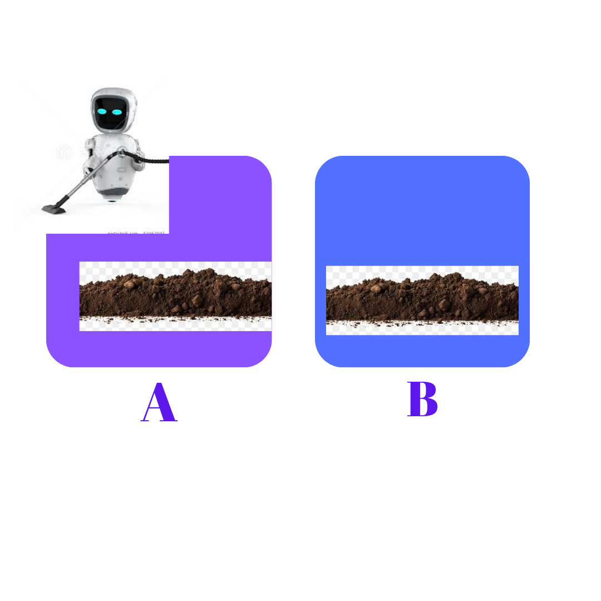
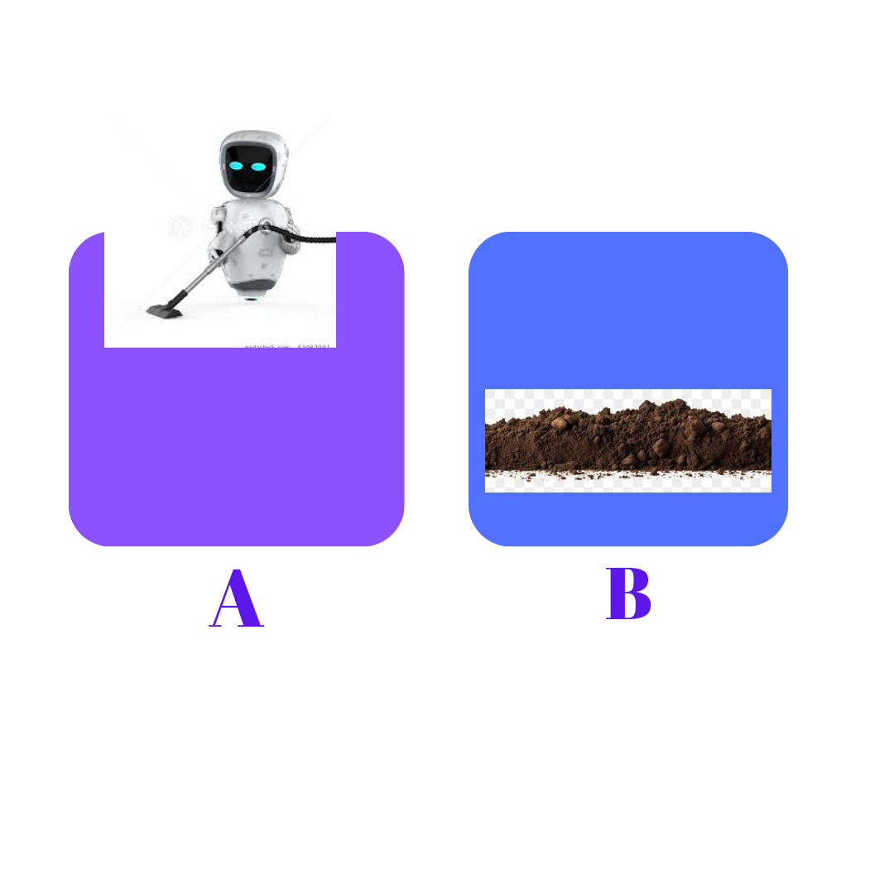
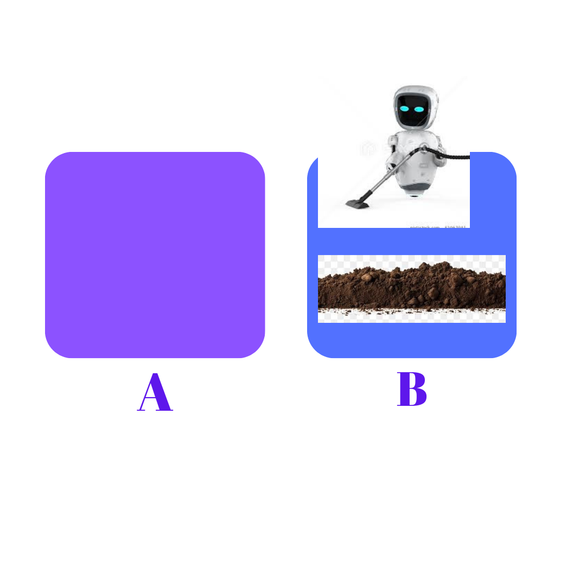
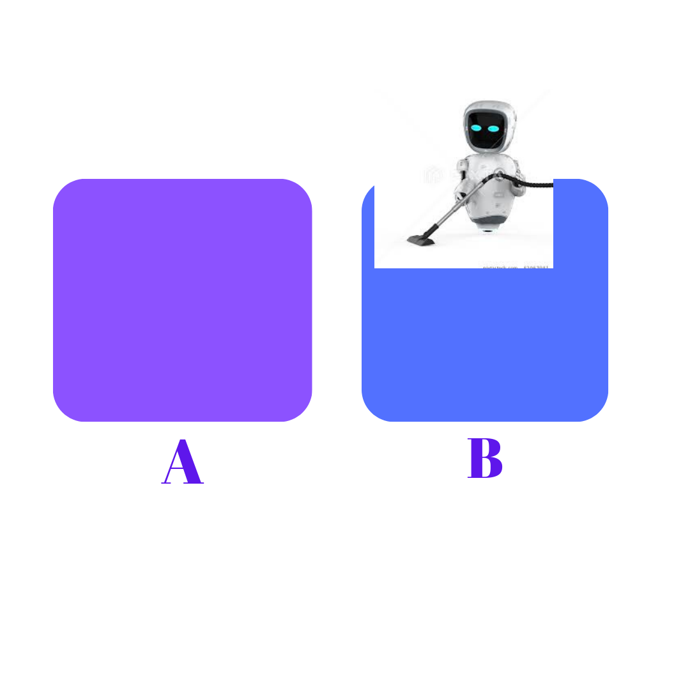

# Table-Driven Agent

## Concept Overview

A Table-Driven Agent is a simple approach in artificial intelligence where decision-making is based on predefined tables or mappings. These tables associate specific actions with combinations of environmental percepts, allowing the agent to respond to different scenarios systematically.

# Illustration

# Table-Driven Agent

## Concept Overview

In the realm of artificial intelligence, a Table-Driven Agent is a straightforward approach to decision-making. The core idea revolves around using predefined tables or mappings to guide the agent's behavior. These tables establish a connection between observed states (percepts) and corresponding actions, providing a systematic way for the agent to respond to different situations.

## Real-Life Analogy: Traffic Light Control System

To better grasp the concept, let's consider a real-life analogy – the traffic light control system:

- **Environment:** The road intersection.
- **Percepts:** The current state of traffic at the intersection (e.g., cars waiting, pedestrians crossing).
- **Actions:** The signals displayed by the traffic lights (e.g., red, green, yellow).

In this scenario, the traffic light control system acts as a Table-Driven Agent. It follows predefined rules or tables that dictate the actions based on observed conditions. For instance, if the system perceives heavy traffic from one direction, it might extend the green light duration for that direction.

## Key Components

### 1. **Tables or Mappings:**
   - These define the relationships between different percepts and the corresponding actions the agent should take.

### 2. **Percepts:**
   - Represent the current observations or state of the environment that influence the agent's decision.

### 3. **Actions:**
   - The set of possible responses or behaviors determined by the tables.

## Implementation in AI

In the context of AI programming, the Table-Driven Agent can be implemented using dictionaries or tables. Each entry in the table represents a specific combination of percepts, mapping to the corresponding action the agent should perform.

## Benefits

1. **Simplicity:**
   - The approach is easy to understand and implement, making it suitable for scenarios with well-defined rules.

2. **Modularity:**
   - Tables can be modified or extended independently, allowing for easy updates and adaptations.

3. **Transparency:**
   - The decision-making process is transparent and traceable, as actions are directly tied to observable states.

## Conclusion

Table-Driven Agents offer a structured and systematic way for artificial intelligence systems to make decisions. By mapping observed states to predefined actions, these agents provide a clear and adaptable framework for responding to diverse environments, much like the logic behind a traffic light control system.
